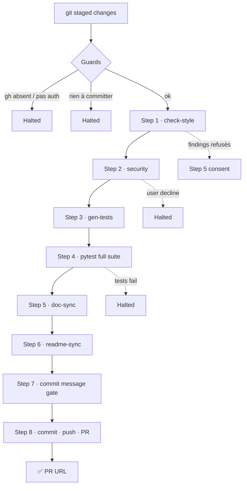

# Shapsha — Python Quality Plugin for Claude Code

[](https://claude.ai/code)
[](https://github.com/NASSWIEL/Shapsha)
[](https://github.com/NASSWIEL/Shapsha)
[](https://python.org)

**Automatise les pratiques qualité Python en un seul pipeline : lint, sécurité, tests, docs, commit et PR — tout ça depuis Claude Code.**

Chaque finding est soit corrigé automatiquement, soit corrigé avec ton consentement, soit refusé avec une raison structurée. **Rien n'est ignoré silencieusement.**

---

## ⚡ Quick Start

```bash
# 1. Lancer Claude Code
claude

# 2. Ajouter le marketplace
/plugin marketplace add NASSWIEL/Shapsha

# 3. Installer le plugin
/plugin install starter@Shapsha

# 4. Initialiser ton projet
/starter:proj-init

# 5. Valider et shipper
/starter:preflight
```

---

## 🔧 Comment ça fonctionne

Chaque skill agit sur le **diff git par défaut** (fichiers modifiés uniquement). Passe l'argument `all` pour agir sur tout le codebase.

### Pipeline `/starter:preflight`



### Architecture fan-out

Les skills `check-style`, `security`, `gen-tests` et `doc-sync` lancent **N sous-agents en parallèle** — un par fichier, tous dans un seul message. Résultat : le temps d'exécution = celui du fichier le plus lent, pas la somme de tous.

```
Parent skill
     │
     ├── agent fichier A  ──┐
     ├── agent fichier B  ──┤ → agrégation → résumé final
     └── agent fichier C  ──┘
```

---

## 📋 Commandes

| Commande | Quand l'utiliser | Ce qu'elle fait |
|---|---|---|
| `/starter:proj-init` | Une fois, à la création du projet | Détecte l'environnement, installe les outils, dépose configs et templates |
| `/starter:check-style` | Après avoir modifié des `.py` | ruff (Pass 1) + LLM (Pass 2) — docstrings, renommages, sécurité, complexité |
| `/starter:security` | Après avoir modifié des `.py` | bandit + analyse LLM (auth, injection, secrets, crypto) — consentement unique |
| `/starter:gen-tests` | Après avoir ajouté / modifié du code | Génère les tests manquants, triage mécanique/sémantique, améliore le code source si besoin |
| `/starter:doc-sync` | Après un changement d'API publique | Met à jour `docs/*.md` depuis le diff git |
| `/starter:readme-sync` | Après un changement de surface utilisateur | Met à jour `README.md` (CLI, env vars, dépendances) |
| `/starter:commit` | Pour committer manuellement | Compose un Conventional Commit, valide via gitlint |
| `/starter:commit-push-pr` | Pour shipper une feature | Commit + push + PR (titre EN, corps FR 1–3 bullets) |
| `/starter:preflight` | Avant chaque PR | Pipeline complet, output = URL de la PR |

> **Argument `all`** disponible sur `check-style`, `security` et `gen-tests` : agit sur tout le codebase au lieu du diff.

---

## 🚀 Pipeline Preflight en détail

`/starter:preflight` est **séquentiel, halt-on-failure**. Output sur succès : l'URL de la PR.

| # | Étape | Comportement |
|---|---|---|
| 1 | `check-style` | Jamais halt — tout est corrigé ou refusé avec raison |
| 2 | `security` | Halt si l'utilisateur refuse le consentement ou si des findings restent |
| 3 | `gen-tests` | Halt si collection fail ou si les tests sémantiques restent en échec après 2 itérations |
| 4 | `pytest -q` (full suite) | Halt si exit non-zero |
| 5 | `doc-sync` | Halt si le patch ne s'applique pas |
| 6 | `readme-sync` | Halt si le patch ne s'applique pas |
| 7 | Commit message gate | Compose + valide via gitlint. Réécrit une fois si rejeté |
| 8 | `commit-push-pr` | Halt si `gh pr create` échoue |

**Gardes initiales (dans l'ordre)** :
1. Pas de repo git → halt
2. Aucun changement → halt
3. `gh` CLI absent → halt
4. `gh` non authentifié → halt
5. Changements uniquement unstaged → **auto-stage** (`git add -u` + `.py`/`.md`/`pyproject.toml`) puis continue

---

## 🤖 Sous-agents

Contexte isolé · périmètre UN fichier · mode silencieux · résultat en une ligne.

| Agent | Modèle | Invoqué par | Rôle |
|---|---|---|---|
| `style-fixer` | Sonnet | `check-style` | Corrige tous les codes ruff restants dans UN fichier (docstrings, renommages, imports, syntaxe, sécurité, complexité). Refuse uniquement les renames cross-fichier |
| `security-fixer` | Sonnet | `security` | Applique les fixes bandit (B-codes) et LLM (`LLM-AUTH`, `LLM-INJECTION`…). Suit le fix proposé par le parent |
| `test-writer` | Sonnet | `gen-tests` | Génère tests golden + erreur + boundary. Pre-mock des dépendances lourdes. `sys.modules.pop` pour isolation entre fichiers |
| `doc-patcher` | Sonnet | `doc-sync` | Patche UN `docs/*.md` depuis le diff. Lit `index.md` + le doc cible uniquement |
| `readme-patcher` | Sonnet | `readme-sync` | Patche `README.md` quand la surface utilisateur change. Préserve le ton français |
| `test-fixer` | Haiku | *(inutilisé)* | Conservé mais non invoqué — le parent gère les fixes mécaniques directement |

---

## ⚙️ Configuration

### Choix du runner

`/starter:proj-init` détecte automatiquement le runner selon l'état du projet :

| Signal détecté | Runner choisi |
|---|---|
| `.venv/` présent (sans markers poetry) | `venv` (via uv) — silencieux |
| `poetry.lock` ou `[tool.poetry]` présent | `poetry` — silencieux |
| `requirements.txt` uniquement | Demande à l'utilisateur |
| Projet vide | Demande à l'utilisateur |
| `[tool.starter].runner` déjà défini | Réutilise silencieusement |

Le choix est persisté dans `pyproject.toml` :
```toml
[tool.starter]
runner = "venv"   # ou "poetry"
```

### Règles ruff activées

```
E, W  · Style PEP8         F  · Erreurs Python      B  · Bugbear
S     · Sécurité           N  · Nommage              C90 · Complexité
PL    · Pylint             D  · Docstrings Google    I   · Imports (isort)
UP    · Modernisation
```

Complexité cyclomatique max : **10** (configurable via `[tool.ruff.lint.mccabe]`).

---

## 📋 Pré-requis

- **[`uv`](https://docs.astral.sh/uv/)** ou **[`poetry`](https://python-poetry.org/)** — au moins l'un des deux
- **`git`**
- **[`gh`](https://cli.github.com)** authentifié (`gh auth login`) — requis pour `commit-push-pr` et `preflight`

Les outils suivants sont installés automatiquement par `proj-init` dans l'environnement du projet :
`ruff` · `bandit` · `pyright` · `pytest` · `pytest-cov` · `gitlint-core`

---

## 🔍 Sécurité : deux passes

### Pass 1 — bandit SAST
Scanne tous les niveaux de sévérité (pas de filtre `-ll -ii`). ~30 B-codes couverts.

### Pass 2 — Analyse LLM-native (HIGH confidence uniquement)

| Tag | Ce que le modèle cherche |
|---|---|
| `LLM-AUTH` | Endpoints sans contrôle d'accès, IDOR |
| `LLM-INJECTION` | Input non fiable → shell / SQL / eval / template |
| `LLM-LOGIC` | TOCTOU, race conditions, validation manquante |
| `LLM-SECRET` | Clés API, JWT, tokens en dur non détectés par bandit |
| `LLM-CRYPTO` | IVs en dur, mode ECB, `random.seed(constante)` |
| `LLM-SECOND-ORDER` | Données persistées puis désérialisées sans sanitisation |

Les findings bandit + LLM sont **fusionnés** avant le consentement unique.

---

## ❓ FAQ

**Q : Que se passe-t-il si je refuse le consentement sécurité dans preflight ?**

`preflight` s'arrête à l'étape 2. Les findings sont reportés, rien n'est modifié. Tu peux relancer `/starter:preflight` quand tu es prêt.

**Q : `gen-tests` modifie mon code source ?**

Seulement si les tests générés **échouent pour une raison sémantique** (le code ne satisfait pas l'assertion). Le skill propose les changements, te demande ton consentement, puis applique. Les fichiers de tests eux-mêmes ne sont jamais affaiblis.

**Q : Comment changer le seuil de complexité cyclomatique ?**

Dans ton `pyproject.toml` :
```toml
[tool.ruff.lint.mccabe]
max-complexity = 8
```

**Q : `preflight` stage automatiquement mes fichiers ?**

Oui, si **rien n'est stagé** à l'entrée. Il lance `git add -u` + les fichiers `.py`/`.md`/`pyproject.toml` non-trackés. Les fichiers scratch, temp, et `.env` ne sont pas stagés.

**Q : Quel est le format des messages de commit ?**

[Conventional Commits 1.0](https://www.conventionalcommits.org/) — `<type>(<scope>?): <subject>` en anglais, sujet ≤ 72 chars. Validé via `gitlint`. Le corps de PR est en **français**, 1–3 bullets factuels.

---

## 📂 Structure du repo

```
Shapsha/
├── .claude-plugin/
│   ├── marketplace.json        # Marketplace "Shapsha"
│   └── plugin.json             # Plugin "starter" v2.0.0
│
├── skills/                     # 7 skills model-invokables
│   ├── check-style/SKILL.md
│   ├── security/SKILL.md
│   ├── gen-tests/SKILL.md
│   ├── doc-sync/SKILL.md
│   ├── readme-sync/SKILL.md
│   ├── preflight/SKILL.md
│   └── proj-init/SKILL.md
│
├── commands/                   # 2 commandes déterministes
│   ├── commit.md
│   └── commit-push-pr.md
│
├── agents/                     # 6 sous-agents isolés
│   ├── style-fixer.md
│   ├── security-fixer.md
│   ├── test-writer.md
│   ├── test-fixer.md
│   ├── doc-patcher.md
│   └── readme-patcher.md
│
├── templates/                  # Copiés par proj-init
│   ├── pyproject/              # Fragments ruff, bandit, pytest, pyright
│   ├── docs/                   # 6 squelettes de docs FR
│   ├── gitlint
│   ├── gitignore.python
│   └── README.md
│
├── tools/                      # Helpers Python du plugin
│   ├── resolve_runner.py
│   └── list_changed.py
│
└── docs/
    └── design.md               # Documentation technique complète
```

---

## 📄 Licence

Proprietary — CGI.

---

*Construit par [NASSWIEL](https://github.com/NASSWIEL) · Propulsé par [Claude Code](https://claude.ai/code)*
