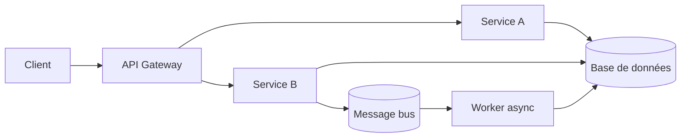

<!--
TEMPLATE — Architecture
=======================
Public cible : (1) une IA assistante de développement qui doit raisonner sur le système
sans relire tout le code à chaque tâche, (2) un humain qui prend le projet en cours.

Ce document est VIVANT : il est mis à jour avant chaque PR (par un skill IA, validé par
un humain). Il décrit le système TEL QU'IL EST, pas tel qu'on aimerait qu'il soit. Les
intentions et décisions à venir vont dans les ADR ou dans la backlog, pas ici.

Garde-fous d'écriture :
- Tout chiffre / nom de composant doit être vérifiable depuis le code ou un artefact
  versionné. Si déduit ou hypothétique, marquer explicitement "(à confirmer)".
- Distinguer "observé" / "décidé" / "ouvert".
- Toute affirmation forte → renvoyer vers un fichier source (code, ADR, schéma).
- Préférer les tableaux et listes courtes à la prose. Une PR doit pouvoir patcher 3 lignes,
  pas un paragraphe.

Le bloc "Mode d'emploi" en fin de fichier détaille la marche à suivre pour l'IA et le relecteur.
-->

# Architecture — {{NOM_PROJET}}

| Champ | Valeur |
|---|---|
| **Dernière mise à jour** | {{AAAA-MM-JJ}} |
| **Mise à jour par** | {{Auteur PR / agent IA}} |
| **PR de référence** | {{#PR ou commit}} |
| **Version applicative** | {{tag / SHA / version sémantique}} |
| **Statut du document** | {{Brouillon / Validé / À retravailler}} |

> **Résumé en 1 phrase** : {{Phrase unique décrivant ce que fait le système et pour qui.}}

---

## 1. Vue d'ensemble

### 1.1 Nature du système

| Dimension | Valeur |
|---|---|
| **Type** | {{Web app / API / Batch / CLI / Bibliothèque / Service / Mixte}} |
| **Mode** | {{Synchrone / Asynchrone / Streaming / Mixte}} |
| **Multi-tenant** | {{Oui / Non — préciser cloisonnement}} |
| **Stateful** | {{Avec / sans état persistant — où réside l'état}} |
| **Utilisateurs cibles** | {{Internes / externes / machines / mixte}} |
| **Volumétrie typique** | {{RPS, lignes/jour, événements/seconde — chiffres réels}} |

### 1.2 Flux principal

> Décrire en 5-10 lignes le chemin d'une requête / d'un enregistrement / d'un événement de l'entrée à la sortie, en nommant les composants traversés. Cette section est le « tour express » d'un nouveau venu.

{{Description du flux nominal — entrée → traitement → sortie. Citer les composants par leur nom de code.}}

---

## 2. Stack technique

| Couche | Choix | Version | Justification courte |
|---|---|---|---|
| **Langage principal** | {{Java / Python / TypeScript / Go / …}} | {{x.y}} | {{1 ligne}} |
| **Framework applicatif** | {{Spring Boot / FastAPI / Next.js / …}} | {{x.y}} | {{}} |
| **Persistance** | {{PostgreSQL / Oracle / DynamoDB / …}} | {{x.y}} | {{}} |
| **Cache** | {{Redis / Caffeine / aucun}} | {{x.y}} | {{}} |
| **Messaging** | {{Kafka / RabbitMQ / SQS / aucun}} | {{x.y}} | {{}} |
| **Auth** | {{OIDC / JWT / mTLS / …}} | — | {{}} |
| **Observabilité** | {{OpenTelemetry / Prometheus / Datadog / …}} | — | {{}} |
| **CI/CD** | {{GitHub Actions / GitLab CI / Jenkins / …}} | — | {{}} |
| **Déploiement** | {{Kubernetes / VM / Lambda / …}} | — | {{}} |

**Dépendances externes critiques** (services tiers dont la panne dégrade le service) :

| Service | Rôle | Mode d'appel | Fallback |
|---|---|---|---|
| {{Nom}} | {{Rôle}} | {{HTTP / SDK / file}} | {{Comportement si KO}} |

---

## 3. Pattern d'architecture

### 3.1 Style retenu

{{Monolithe modulaire / Microservices / Hexagonal / Clean / Event-driven / Procédural / Serverless / Mixte — décrire en 3 lignes pourquoi ce style.}}

> Décision tracée dans : {{lien vers ADR}}

### 3.2 Diagramme de composants

> Diagramme Mermaid (rendu nativement par GitLab/GitHub). Montrer les composants principaux et le sens des appels — pas les classes.



### 3.3 Propriétés architecturales

| Propriété | Valeur observée | Justification / mécanisme |
|---|---|---|
| **Couplage** | {{Fort / faible}} | {{Entre quels composants}} |
| **Cohésion** | {{Haute / moyenne / basse}} | {{Par quelle unité — domaine, module, fichier}} |
| **Concurrence** | {{Séquentielle / parallèle / multi-thread / réactive}} | {{Modèle d'exécution}} |
| **Idempotence** | {{Garantie / partielle / absente}} | {{Sur quelles opérations, mécanisme}} |
| **Cohérence** | {{Forte / éventuelle}} | {{ACID / BASE / sagas}} |
| **Scalabilité** | {{Horizontale / verticale / les deux}} | {{Comment, jusqu'où}} |

---

## 4. Composants

> Une ligne par composant principal. Détail dans les sous-sections si nécessaire. Les composants triviaux (ex. utilitaires sans logique) ne sont pas listés ici.

| Composant | Type | Localisation | Rôle | Entrées | Sorties |
|---|---|---|---|---|---|
| {{Nom}} | {{Service / Module / Lib}} | {{`src/...`}} | {{1 ligne}} | {{HTTP / DB / queue}} | {{idem}} |
| {{Nom}} | {{}} | {{}} | {{}} | {{}} | {{}} |

### 4.1 Détails par composant {{(à dupliquer pour chaque composant non trivial)}}

#### {{NOM_COMPOSANT}}

- **Rôle** : {{1-2 lignes}}
- **Entrées** : {{Listes — sources}}
- **Sorties** : {{Liste — destinations}}
- **Dépendances internes** : {{autres composants appelés}}
- **Dépendances externes** : {{services tiers, base, queue}}
- **Invariants** : {{conditions toujours vraies à la sortie}}
- **Pièges connus** : {{comportements contre-intuitifs documentés}}

---

## 5. Architecture des données

> Vue résumée. Le détail (tables, colonnes, contraintes) est dans [data-model.md](data-model.md).

| Domaine | Stockage | Tables / collections | Volumétrie | Croissance |
|---|---|---|---|---|
| {{Domaine}} | {{PostgreSQL / S3 / Redis}} | {{Liste}} | {{Ordre}} | {{Faible / linéaire / illimitée}} |

**Pattern temporel** : {{SCD Type 1 / 2 / append-only / snapshot / aucun versioning — décrire le mécanisme.}}

**Politique de rétention** : {{Conservation, archivage, purge — par domaine.}}

---

## 6. Interfaces

> Vue résumée. Le détail (signatures, payloads, codes retour) est dans [contracts.md](contracts.md).

### 6.1 Interfaces exposées

| Interface | Type | Consommateurs | Stabilité |
|---|---|---|---|
| {{Nom}} | {{REST / gRPC / GraphQL / event / CLI}} | {{Internes / externes / partenaires}} | {{Public versionné / interne / privé}} |

### 6.2 Interfaces consommées

| Interface | Fournisseur | Type d'appel | Criticité |
|---|---|---|---|
| {{Nom}} | {{Service / équipe}} | {{Sync / async}} | {{Bloquante / dégradable}} |

---

## 7. Déploiement

### 7.1 Topologie

```
{{Schéma textuel ou ASCII : environnements (dev / staging / prod), nombre d'instances,
réplication, zones de disponibilité.}}
```

### 7.2 Environnements

| Environnement | URL / Cluster | Données | Auth | Trafic |
|---|---|---|---|---|
| **dev** | {{}} | {{Anonymisées / synthétiques}} | {{}} | {{}} |
| **staging** | {{}} | {{Captures prod anonymisées}} | {{}} | {{}} |
| **prod** | {{}} | {{Réelles}} | {{}} | {{Utilisateurs réels}} |

### 7.3 Configuration

- **Format** : {{YAML / env vars / Vault / fichier propriétaire}}
- **Source de vérité** : {{Repo, secret manager, etc.}}
- **Secrets** : {{Mécanisme — jamais en clair dans le repo}}
- **Feature flags** : {{Outil — LaunchDarkly / Unleash / fichier — granularité par utilisateur / pourcentage / segment}}

---

## 8. Préoccupations transverses

### 8.1 Sécurité

| Aspect | Mécanisme | Localisation |
|---|---|---|
| **Authentification** | {{}} | {{}} |
| **Autorisation** | {{RBAC / ABAC / scopes}} | {{}} |
| **Secrets** | {{Vault / KMS / variables d'environnement}} | — |
| **Données sensibles** | {{Chiffrement au repos / en transit / pseudonymisation}} | {{}} |
| **Audit** | {{Logs immuables, qui-fait-quoi-quand}} | {{}} |

### 8.2 Observabilité

| Type | Outil | Volume | Rétention | Alerting |
|---|---|---|---|---|
| **Logs** | {{}} | {{}} | {{}} | {{}} |
| **Métriques** | {{}} | {{}} | {{}} | {{}} |
| **Traces** | {{}} | {{Échantillonnage}} | {{}} | {{}} |
| **Erreurs** | {{Sentry / Rollbar}} | — | {{}} | {{}} |

**Convention de corrélation** : {{`X-Request-Id`, `traceparent`, `correlationId` MDC — propagé jusqu'où.}}

### 8.3 Performance

| Métrique | Cible (SLO) | Mesure actuelle | Source |
|---|---|---|---|
| **Latence p95** | {{}} | {{}} | {{Dashboard}} |
| **Latence p99** | {{}} | {{}} | {{}} |
| **Disponibilité** | {{}} | {{}} | {{}} |
| **Débit max** | {{}} | {{}} | {{}} |

### 8.4 Résilience

- **Timeouts** : {{Valeurs — par appel sortant, par requête entrante}}
- **Retry** : {{Politique — exponentiel, idempotence requise}}
- **Circuit breaker** : {{Outil, seuils}}
- **Backpressure** : {{Mécanisme — file bornée, rejet, throttling}}
- **Plan de reprise** : {{RTO / RPO, runbooks — lien}}

---

## 9. Stratégie de test

| Niveau | Framework | Couverture | Quand |
|---|---|---|---|
| **Unitaire** | {{}} | {{% lignes — chiffre réel}} | À chaque commit |
| **Intégration** | {{}} | {{Quelles couches ensemble}} | À chaque PR |
| **Contract** | {{Pact / Spring Cloud Contract}} | {{Quelles interfaces}} | À chaque PR |
| **End-to-end** | {{Cypress / Playwright}} | {{Parcours critiques listés}} | Avant release |
| **Charge** | {{k6 / JMeter}} | {{}} | {{Périodicité}} |
| **Sécurité** | {{SAST / DAST / dépendances}} | {{}} | {{}} |

**Données de test** : {{Origine — fixtures, captures anonymisées, factories — où sont-elles versionnées.}}

---

## 10. Workflow de développement

- **Branches** : {{Modèle — trunk-based / GitFlow}}
- **Convention de commits** : {{Conventional Commits / autre}}
- **CI** : {{Étapes — lint, build, tests, scan, déploiement}}
- **Code review** : {{Nb relecteurs, règles de protection de branche}}
- **Mise à jour de cette doc** : {{Skill IA `/...` exécuté en pre-PR + relecture humaine — voir mode d'emploi en fin de fichier.}}

---

## 11. Décisions et points ouverts

### 11.1 Décisions actives

| ADR | Sujet | Date | Statut |
|---|---|---|---|
| {{ADR-NNNN}} | {{Titre court}} | {{AAAA-MM-JJ}} | {{Accepté / Superseded par ADR-XXXX}} |

### 11.2 Points ouverts

> Ce qui n'est pas tranché, source de risque ou de surprise pour un nouveau venu.

| # | Question | Impact | Owner |
|---|---|---|---|
| Q1 | {{}} | {{}} | {{}} |

### 11.3 Dette technique structurante

> Limitations connues qui orientent la lecture du code. Ne pas lister chaque TODO ; uniquement ce qui change la grille de lecture du système.

| Item | Origine | Coût d'évitement | Plan |
|---|---|---|---|
| {{}} | {{Historique / contrainte legacy}} | {{Ce que ça interdit aujourd'hui}} | {{Quand / comment lever}} |

---

## 12. Références

- Modèle de données : [data-model.md](data-model.md)
- Contrats d'interface : [contracts.md](contracts.md)
- Glossaire : [glossaire.md](glossaire.md)
- Documentation fonctionnelle : [fonctionnel.md](fonctionnel.md)
- Index général : [index.md](index.md)
- ADR : [{{lien dossier ADR}}]({{lien dossier ADR}})
- Runbooks ops : {{lien}}
- Dashboards : {{lien}}

---

<!--
MODE D'EMPLOI DU TEMPLATE
=========================

POUR L'IA QUI MET À JOUR CE DOCUMENT AVANT UNE PR

Déclencheurs (mettre à jour les sections concernées si la PR touche…) :

| Modification dans la PR | Sections à relire |
|---|---|
| Ajout / suppression / renommage d'un service ou module | §3 (diagramme), §4 (composants) |
| Changement de stack (langage, framework, lib majeure) | §2 |
| Nouvelle table / collection ou schéma modifié | §5 (résumé), data-model.md (détail) |
| Nouvelle interface exposée ou consommée | §6, contracts.md (détail) |
| Changement d'environnement, IaC, manifestes K8s | §7 |
| Nouveau mécanisme d'auth, audit, secrets | §8.1 |
| Nouveau collecteur logs / métriques / dashboards | §8.2 |
| SLO, timeout, retry, circuit breaker modifiés | §8.3, §8.4 |
| Nouveau type de test, framework de test | §9 |
| Changement de workflow CI ou règle de branche | §10 |
| Nouvel ADR fusionné | §11.1 |

Règles d'écriture :
1. Mettre à jour le bloc d'en-tête (date, PR de référence, version, mise à jour par).
2. Pour chaque modification, citer la PR ou le commit en référence si non évident.
3. Ne pas réécrire des sections inchangées — diff minimal.
4. Marquer "(à confirmer)" toute affirmation non vérifiable depuis le code à l'instant T.
5. Si une section devient obsolète, la VIDER avec une mention "Aucun {{X}} actuellement"
   plutôt que la supprimer — l'absence est une information.
6. Si la doc et le code divergent, ouvrir un point dans §11.2 et le signaler dans le
   message de PR — ne PAS aligner silencieusement.

Auto-checks à effectuer avant de proposer la mise à jour :
- [ ] Les composants listés en §4 existent réellement dans le repo (vérifier les chemins).
- [ ] Le diagramme Mermaid §3.2 correspond aux appels effectivement présents dans le code.
- [ ] Les versions §2 correspondent au manifeste de dépendances actuel.
- [ ] Les ADR cités §11.1 existent dans le dossier ADR.
- [ ] Les liens des §12 ne sont pas cassés.

POUR LE RELECTEUR HUMAIN

- Le diff doit être lisible : si plus de 30 lignes changent, demander à l'IA de
  scinder par section.
- Vérifier que les chiffres (SLO, volumétrie, version) ne sont pas inventés.
- Toute hypothèse "(à confirmer)" doit être levée ou explicitement assumée.
- Si une section est trop générique (pleine de "{{}}" non remplis), c'est un signe que
  la section n'a jamais été vraiment travaillée — la signaler ou la vider.

POUR ADAPTER À UN AUTRE PROJET

1. Remplacer `{{NOM_PROJET}}` et tous les autres `{{...}}`.
2. Garder les 12 sections et leur ordre — c'est la grille standard.
3. Une section vide est légitime si « non applicable » ; le marquer explicitement.
4. Adapter le diagramme Mermaid §3.2 au style réel (peut être un schéma C4 niveau 2,
   un diagramme de séquence, etc.).
5. Pour un système purement frontal : §5 et §6 peuvent être minces, mais ne pas
   supprimer — pointer vers le backend qui porte ces aspects.
6. Pour un système purement batch : adapter §1.2 ("flux principal" = traitement d'un fichier),
   §6 (interfaces = formats E/S), §8.3 (perf = débit + temps fenêtre).
-->
