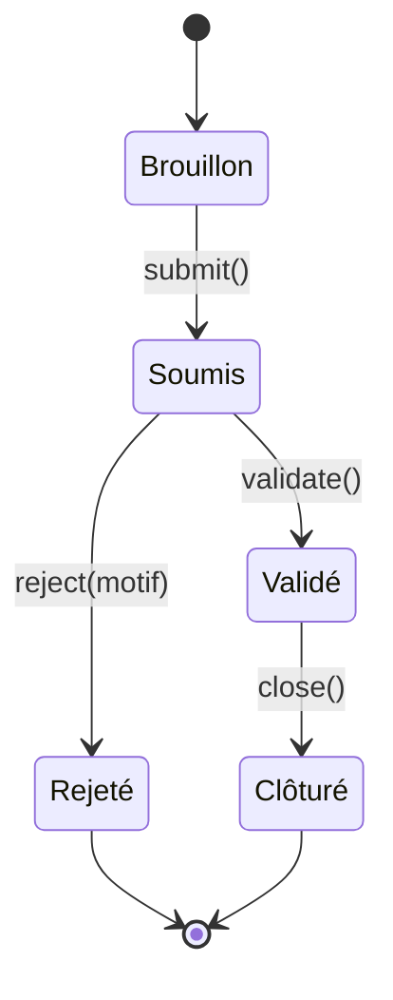

<!--
TEMPLATE — Documentation fonctionnelle
=======================================
Public cible : (1) une IA qui doit comprendre POURQUOI un comportement existe avant de
le modifier, (2) un humain (PO, dev qui arrive, support) qui veut connaître les règles
métier sans lire le code.

Ce document est la VOIX DU MÉTIER — pas du code. Il décrit ce que le produit fait, pour
qui, dans quelles conditions, avec quelles règles. Le HOW (techno, archi) vit dans
[architecture.md](architecture.md). Le QUOI (signatures) vit dans [contracts.md](contracts.md).

Garde-fous :
- Pas de jargon technique ici. Si un terme technique est nécessaire, soit on l'explique,
  soit on renvoie au glossaire.
- Une règle métier doit être tracée à un cas d'usage et idéalement à un test fonctionnel.
- Les hors-scope (« ce que le produit NE fait PAS ») sont aussi importants que les scopes —
  ils évitent de sur-interpréter.

Bloc « Mode d'emploi » en fin de fichier.
-->

# Documentation fonctionnelle — {{NOM_PROJET}}

| Champ | Valeur |
|---|---|
| **Dernière mise à jour** | {{AAAA-MM-JJ}} |
| **Mise à jour par** | {{Auteur PR / agent IA}} |
| **PR de référence** | {{#PR}} |
| **Owner produit** | {{Nom / équipe}} |
| **Statut** | {{Validé par le PO / À retravailler}} |

> **Pitch en 1 phrase** : {{Ce que le produit fait, pour qui, et le bénéfice central.}}

---

## 1. Vision et raison d'être

### 1.1 Problème adressé

{{2-4 lignes : quel problème métier ce système résout-il ? Pourquoi il existe.}}

### 1.2 Bénéfices clés

| Pour | Bénéfice | Mesuré par |
|---|---|---|
| {{Persona / rôle}} | {{1 ligne}} | {{KPI / indicateur}} |

### 1.3 Hors-scope

> Ce que le produit ne fait PAS — délibérément. Inclure les fonctionnalités souvent confondues avec ce produit.

| Ce qui est hors-scope | Pourquoi | Alternative |
|---|---|---|
| {{}} | {{Décision produit / contrainte / autre système le fait}} | {{Outil / système où aller}} |

---

## 2. Personas et utilisateurs

| Persona | Rôle | Fréquence d'usage | Objectif principal | Compétences attendues |
|---|---|---|---|---|
| **{{Persona A}}** | {{Métier / utilisateur final / ops / partenaire}} | {{Quotidien / mensuel / ponctuel}} | {{}} | {{Aucune / formé / expert}} |
| **{{Persona B}}** | {{}} | {{}} | {{}} | {{}} |
| **{{Système / machine}}** | {{Service appelant}} | {{}} | {{}} | — |

> Pour chaque persona, lister les **cas d'usage prioritaires** dans §3.

---

## 3. Cas d'usage

### 3.1 Carte des cas d'usage

| ID | Cas d'usage | Persona | Fréquence | Criticité |
|---|---|---|---|---|
| UC-01 | {{}} | {{}} | {{}} | {{Critique / standard / annexe}} |
| UC-02 | {{}} | {{}} | {{}} | {{}} |

### 3.2 Détail par cas d'usage

> Un bloc par UC critique. Forme abrégée pour les UC standards.

#### UC-01 — {{Titre}}

| Méta | Valeur |
|---|---|
| **Persona** | {{}} |
| **Pré-conditions** | {{Ce qui doit être vrai avant}} |
| **Post-conditions** | {{Ce qui doit être vrai après — succès et échec}} |
| **Déclencheur** | {{Action utilisateur / événement / horaire}} |
| **Fréquence** | {{}} |
| **Volumétrie** | {{Nombre de cas / jour}} |
| **SLA** | {{Temps de réponse attendu côté utilisateur}} |
| **Endpoint(s) / écran(s)** | [{{lien contracts.md}}](contracts.md) |
| **Règles métier appliquées** | RG-XX, RG-YY (voir §4) |

**Scénario nominal**

1. {{Action 1}}
2. {{Action 2}}
3. {{Action 3}}

**Scénarios alternatifs**

| Variante | Condition | Comportement |
|---|---|---|
| {{Alt 1}} | {{Si X}} | {{Au lieu de l'étape 2, …}} |

**Cas d'erreur métier**

| Cas | Détection | Message utilisateur | Effet |
|---|---|---|---|
| {{}} | {{Étape où ça arrive}} | {{Ce que voit l'utilisateur}} | {{Rollback / partiel / rejeu}} |

**Pièges connus**

- ⚠️ {{Comportement non évident attendu — ex. action irréversible, double validation, contournement métier accepté}}

---

## 4. Règles de gestion

> Toute règle métier nommée. Une RG = une assertion sur le système, formulée en langage métier, idéalement testable.

### 4.1 Catalogue

| ID | Nom | Domaine | Cas d'usage liés | Statut |
|---|---|---|---|---|
| RG-01 | {{Nom court}} | {{Domaine fonctionnel}} | UC-01, UC-03 | {{Active / En attente / Dépréciée}} |
| RG-02 | {{}} | {{}} | {{}} | {{}} |

### 4.2 Détail par règle

#### RG-01 — {{Nom}}

- **Énoncé** : {{Phrase complète, voix active, langage métier}}
- **Pré-conditions** : {{Quand cette règle s'applique}}
- **Effet** : {{Ce qu'elle impose / autorise / interdit}}
- **Origine** : {{Réglementation / décision PO / contrainte technique / historique}}
- **Implémentation** : [{{chemin/fichier:ligne}}]({{chemin/fichier#L42}})
- **Tests fonctionnels** : [{{chemin}}]({{chemin}})
- **Évolutions** :
  | Date | PR | Changement |
  |---|---|---|
  | {{AAAA-MM-JJ}} | {{#PR}} | {{Création / amendement}} |

---

## 5. Workflows et machines à états

> Si le métier comporte des entités avec un cycle de vie (commande, dossier, demande, contrat), modéliser ici la machine à états. Sinon, supprimer la section.

### 5.1 {{Entité X}}

| Transition | Acteur | Pré-condition | Effet | Règles appliquées |
|---|---|---|---|---|
| `Brouillon → Soumis` | {{Persona A}} | {{Champs obligatoires remplis}} | {{Notification envoyée}} | RG-01, RG-03 |
| `Soumis → Validé` | {{Persona B}} | {{Vérifications OK}} | {{}} | RG-02 |
| `Soumis → Rejeté` | {{Persona B}} | {{Motif renseigné}} | {{Notification au demandeur}} | RG-04 |

**Invariants** :

- {{Une entité dans l'état X ne peut pas …}}
- {{Le passage Y → Z est irréversible}}

---

## 6. Données métier de référence

> Référentiels et énumérations qui ont une signification métier. Le détail technique vit dans [data-model.md](data-model.md).

| Référentiel | Valeurs | Source de vérité | Mise à jour |
|---|---|---|---|
| **{{Statuts X}}** | {{Liste valeurs : libellés métier}} | {{Table / fichier / API externe}} | {{Manuel / sync auto}} |
| **{{Types Y}}** | {{}} | {{}} | {{}} |

---

## 7. Cas limites et pathologiques

> Comportements aux extrémités du fonctionnel. Ces cas sont la principale source de bugs en production — les documenter explicitement.

| Cas | Comportement attendu | Justification |
|---|---|---|
| **Volumes** | {{Que se passe-t-il à 0 / 1 / 1M occurrences ?}} | {{}} |
| **Concurrence** | {{2 utilisateurs agissent en même temps sur la même entité}} | {{Verrouillage / dernière écriture gagne / fusion}} |
| **Timezone / DST** | {{Heure d'été, fuseau utilisateur ≠ fuseau serveur}} | {{}} |
| **Caractères spéciaux** | {{Unicode, emojis, RTL, longueurs extrêmes}} | {{}} |
| **Champs vides / NULL** | {{Sémantique « vide » vs « non renseigné » vs « zéro »}} | {{}} |
| **Reprise après panne** | {{Que se passe-t-il si l'opération échoue à mi-chemin}} | {{}} |
| **Rejeu** | {{Le même événement arrive 2 fois}} | {{Idempotent / dédup / accepter}} |

---

## 8. Conformité et contraintes externes

| Contrainte | Origine | Implémentation |
|---|---|---|
| {{RGPD : droit à l'oubli}} | {{Règlement UE}} | {{Endpoint d'effacement, table de pseudonymisation, voir RG-XX}} |
| {{SOX / audit}} | {{}} | {{}} |
| {{Accessibilité (WCAG)}} | {{Loi}} | {{}} |
| {{Licence des données}} | {{Contrat fournisseur}} | {{}} |
| {{Localisation / souveraineté}} | {{}} | {{Région cloud, chiffrement}} |

---

## 9. KPIs et indicateurs métier

| KPI | Définition | Cible | Source | Dashboard |
|---|---|---|---|---|
| {{Taux de conversion X}} | {{}} | {{}} | {{Table / event}} | [{{lien}}]({{}}) |
| {{Délai moyen Y}} | {{}} | {{}} | {{}} | {{}} |

> Note : ces KPIs orientent les décisions produit. Toute fonctionnalité majeure devrait s'y rattacher.

---

## 10. Roadmap et évolutions notables

> Historique compressé : grands jalons fonctionnels passés et à venir. Pas un changelog détaillé (qui vit dans `CHANGELOG.md` ou les releases).

### 10.1 Jalons passés

| Date | Version | Évolution majeure | PR / RFC |
|---|---|---|---|
| {{AAAA-MM-JJ}} | {{vX.Y}} | {{Lancement de Z, ouverture aux personas A}} | {{}} |

### 10.2 À venir (haut niveau)

| Échéance | Évolution | Statut |
|---|---|---|
| {{Trimestre / sprint}} | {{}} | {{Décidé / en discussion / hypothèse}} |

---

## 11. Questions ouvertes côté métier

> Décisions fonctionnelles non tranchées. Distinct des questions techniques (qui vivent dans le glossaire ou les ADR).

| # | Question | Impact si non tranché | Owner | Ouverte depuis |
|---|---|---|---|---|
| QF-01 | {{}} | {{}} | {{PO / expert métier}} | {{AAAA-MM-JJ}} |

---

## Références

- Vue d'ensemble système : [architecture.md](architecture.md)
- Endpoints / interfaces qui matérialisent les UC : [contracts.md](contracts.md)
- Données qui supportent les règles : [data-model.md](data-model.md)
- Vocabulaire métier détaillé : [glossaire.md](glossaire.md)
- Décisions produit historiques : {{lien Notion / Confluence / RFC}}
- Backlog : {{lien outil de tickets}}

---

<!--
MODE D'EMPLOI DU TEMPLATE
=========================

POUR L'IA QUI MET À JOUR CE FICHIER

⚠️ La doc fonctionnelle est la PLUS DIFFICILE à maintenir par une IA seule — elle décrit
l'INTENTION, qui n'est pas dans le code. L'IA doit ÊTRE PRUDENTE et ne pas inventer du
sens. Si une PR introduit un comportement nouveau dont l'intention n'est pas claire,
laisser un placeholder et SIGNALER dans la PR plutôt que deviner.

Déclencheurs :

| Modification dans la PR | Sections à relire |
|---|---|
| Nouveau parcours utilisateur / endpoint exposé à un humain | §3 (carte + détail) |
| Nouveau persona ou rôle | §2 |
| Nouvelle règle de validation / contrainte métier | §4 |
| Modification d'un état possible / d'une transition | §5 |
| Nouvelle énumération / référentiel métier | §6 |
| Nouveau cas pathologique géré (ou bug fix significatif) | §7 |
| Conformité (RGPD, accessibilité, audit) | §8 |
| Nouveau KPI suivi | §9 |
| Lancement / dépréciation d'une feature majeure | §10.1 |
| Décision produit en attente | §11 |

Règles spéciales :
- Toute RG-XX nouvelle DOIT pointer vers une implémentation et un test (sinon, signalement
  en PR — c'est une RG « orpheline »).
- Si un UC change de comportement nominal, ajouter une ligne dans son sous-bloc « Évolutions »
  (à créer au besoin), ne pas réécrire silencieusement le scénario.
- Les hors-scope §1.3 vieillissent : si une fonctionnalité hors-scope devient scope, la
  retirer de §1.3 ET la documenter dans §3.

Auto-checks :
- [ ] Chaque RG citée dans un UC §3 existe dans §4.
- [ ] Chaque RG §4 cite une implémentation et un test.
- [ ] Chaque transition §5 a une ligne de tableau associée.
- [ ] Le pitch §0 est à jour avec la dernière évolution majeure §10.1.
- [ ] Aucune QF-XX § 11 ouverte depuis > 90 jours sans note de réunion.

POUR LE RELECTEUR HUMAIN (idéalement le PO ou un expert métier)

- Le doc doit pouvoir être lu par un nouvel arrivant non technique en 30 minutes.
- Vérifier que les RG ne sont pas « techniques déguisées » (ex. « le timeout est de 5s »
  est une contrainte non-fonctionnelle, pas une RG).
- Les KPIs §9 doivent provenir d'un dashboard existant, pas être souhaitables.
- Les hors-scope §1.3 méritent un challenge périodique.

POUR ADAPTER À UN AUTRE PROJET

1. C'est le template le plus PROJET-DÉPENDANT. Pour un produit B2C avec écrans : §3 est
   structuré par parcours utilisateur. Pour un service technique B2B : §3 est structuré par
   intégration partenaire.
2. Si le système est purement technique sans utilisateur final (ex. lib, infra) :
   - §2 = systèmes consommateurs.
   - §3 = scénarios d'intégration.
   - §5 et §9 peuvent disparaître.
3. Pour un système legacy en migration : ajouter une section « Comportements à reproduire
   à l'identique » et « Comportements connus non reproduits (et pourquoi) ».
4. Si le projet a une **forte dimension réglementaire** (banque, santé, public) : §8 prend
   beaucoup de place, mériter sa propre subdivision.
-->
