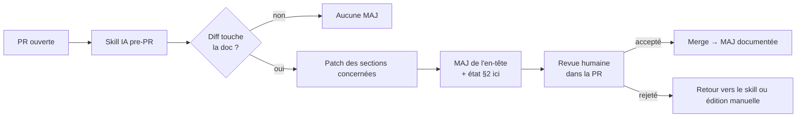

<!--
TEMPLATE — Index
================
Public cible : (1) une IA qui doit choisir QUEL document lire pour traiter une tâche,
(2) un humain qui découvre le projet.

Ce document est le point d'entrée du dossier de doc « vivante ». Il est délibérément
court : il liste les autres documents, leur rôle, leur fraîcheur, et les conventions
transverses qu'on n'a pas voulu dupliquer ailleurs.

Bloc « Mode d'emploi » en fin de fichier pour l'IA et le relecteur.
-->

# Documentation projet — {{NOM_PROJET}}

| Champ | Valeur |
|---|---|
| **Dernière mise à jour** | {{AAAA-MM-JJ}} |
| **Mise à jour par** | {{Auteur PR / agent IA}} |
| **PR de référence** | {{#PR ou commit}} |
| **Version applicative** | {{tag / SHA / version sémantique}} |

> **{{NOM_PROJET}}** — {{Phrase unique : ce que fait le système, pour qui, dans quel contexte.}}

---

## 1. Comment lire cette documentation

| Tu cherches… | Va voir |
|---|---|
| Une vue d'ensemble du système, sa stack, son déploiement | [architecture.md](architecture.md) |
| Le schéma de base / des structures de données | [data-model.md](data-model.md) |
| La signature d'une API, d'un service, d'un événement | [contracts.md](contracts.md) |
| Le sens d'un terme métier ou d'un acronyme | [glossaire.md](glossaire.md) |
| Ce que le produit est censé faire (use cases, règles) | [fonctionnel.md](fonctionnel.md) |
| Une décision d'architecture historique | [{{dossier ADR}}]({{dossier ADR}}) |
| Comment lancer / déployer / contribuer | [{{README ou CONTRIBUTING}}]({{lien}}) |

---

## 2. État de fraîcheur des documents

> Mis à jour automatiquement par le skill IA en pre-PR. Une fraîcheur > 30 jours est un signal — voir §5.

| Document | Dernière MAJ | PR | Statut | Owner doc |
|---|---|---|---|---|
| [architecture.md](architecture.md) | {{AAAA-MM-JJ}} | {{#PR}} | {{Validé / Brouillon / À retravailler}} | {{Équipe / personne}} |
| [data-model.md](data-model.md) | {{AAAA-MM-JJ}} | {{}} | {{}} | {{}} |
| [contracts.md](contracts.md) | {{AAAA-MM-JJ}} | {{}} | {{}} | {{}} |
| [glossaire.md](glossaire.md) | {{AAAA-MM-JJ}} | {{}} | {{}} | {{}} |
| [fonctionnel.md](fonctionnel.md) | {{AAAA-MM-JJ}} | {{}} | {{}} | {{}} |

---

## 3. Conventions transverses

> Conventions partagées par tous les documents. Ne pas les redéfinir ailleurs.

### 3.1 Format des références

- **Fichier** : `[chemin/relatif/fichier.ext](chemin/relatif/fichier.ext)`
- **Ligne précise** : `[fichier.ext:42](chemin/fichier.ext#L42)`
- **Commit** : `{{abréviation 7 car. ou tag}}`
- **PR / issue** : `#NNN` (l'outil de gestion de version résout les liens)

### 3.2 Marqueurs sémantiques

| Marqueur | Signification |
|---|---|
| `(à confirmer)` | Affirmation déduite du code, non validée par un humain expert |
| `⚠️` | Piège, comportement contre-intuitif, point qui fait trébucher |
| `🚧` | En cours de construction — la doc anticipe le code |
| `📦` | Externe — le détail vit dans un autre dépôt / système |
| `(legacy)` | Conservé pour compatibilité, à ne pas étendre |

### 3.3 Diagrammes

- **Mermaid** uniquement (rendu natif GitLab/GitHub).
- Préférer `flowchart` pour les composants, `erDiagram` pour les données, `sequenceDiagram` pour les flux temporels, `stateDiagram-v2` pour les machines à états.
- Si un diagramme dépasse ~30 nœuds, le segmenter par sous-domaine.

### 3.4 Niveau de détail

- **index, glossaire, fonctionnel** : lisibles sans contexte technique.
- **architecture** : lisible par tout dev arrivant ; ne suppose pas la connaissance du métier.
- **data-model, contracts** : exhaustifs, peuvent supposer la lecture préalable de l'architecture.

---

## 4. Cycle de mise à jour

**Règles d'or** :

1. **Pas de PR sans relecture de la doc** — même si le skill ne propose aucun changement, le relecteur valide ce non-changement.
2. **Diff minimal** — un changement de doc doit toucher 1 à 3 sections, pas tout le fichier. Si le skill propose un diff massif, c'est un signal de dérive (la doc n'a pas suivi le code depuis longtemps) — l'investiguer plutôt que merger en l'état.
3. **Doc et code divergents** — ne pas aligner silencieusement. Ouvrir un point ouvert dans le doc concerné, le signaler dans la PR.
4. **Versionner avec le code** — la doc est dans le repo, sur la même branche, dans la même PR. Pas de wiki externe pour le savoir vivant.

---

## 5. Signaux de dérive à surveiller

| Signal | Diagnostic probable | Action |
|---|---|---|
| Fraîcheur > 30 jours sur un fichier alors que le code a bougé | Le skill ne détecte pas certaines modifs | Auditer les déclencheurs du skill |
| Beaucoup de `(à confirmer)` non levés depuis longtemps | Personne n'a la connaissance / l'autorité | Identifier l'owner et planifier un atelier |
| Section vide remplie de `{{}}` dans plusieurs fichiers | Section jamais vraiment travaillée | Décider : la peupler ou la retirer du template |
| Liens cassés (§12 architecture, §6 data-model, etc.) | Renommage / suppression de fichier sans MAJ | À détecter en CI (lint markdown) |
| Doc plus longue que le code qu'elle décrit | Sur-spécification | Élaguer, déléguer aux ADR / au code commenté |

---

## 6. Modules / composants couverts

> Si le projet est découpé en modules/services indépendants, lister ici lesquels ont une fiche détaillée. Sinon, supprimer cette section.

| Module / Service | Type | Fiche détaillée | Code source |
|---|---|---|---|
| {{Nom}} | {{API / Worker / UI / Lib}} | [{{chemin}}/{{nom}}.md]({{chemin}}/{{nom}}.md) | [{{chemin code}}]({{chemin code}}) |

---

## 7. Ressources externes

> Liens vers les sources de vérité qui ne vivent pas dans ce dépôt.

| Ressource | Rôle | Accès |
|---|---|---|
| {{Tickets / backlog}} | {{Suivi des features et bugs}} | {{Lien}} |
| {{Dashboards observabilité}} | {{Métriques live, traces, logs}} | {{Lien}} |
| {{Documentation API publique}} | {{OpenAPI / Postman / portail dev}} | {{Lien}} |
| {{Espace Confluence / Notion / wiki}} | {{Décisions process, RH, comptes-rendus}} | {{Lien}} |
| {{Runbooks ops}} | {{Procédures d'incident}} | {{Lien}} |

---

<!--
MODE D'EMPLOI DU TEMPLATE
=========================

POUR L'IA QUI MET À JOUR CE FICHIER

L'index est mis à jour SYSTÉMATIQUEMENT à chaque PR — au minimum la table §2
(état de fraîcheur). Mises à jour spécifiques selon le diff :

| Modification dans la PR | Sections à toucher |
|---|---|
| TOUTE PR avec changement de doc | §2 (date, PR, statut du fichier modifié) |
| Ajout d'un nouveau document | §1 (table d'orientation), §2 (ligne ajoutée) |
| Changement de stack ou nouvelle convention transverse | §3 |
| Changement du workflow CI / skill | §4 |
| Nouveau module / service avec fiche dédiée | §6 |
| Nouveau lien externe critique (dashboard, runbook) | §7 |

Auto-checks :
- [ ] La date d'en-tête est = date du jour de la PR.
- [ ] Tous les fichiers listés en §2 existent.
- [ ] Aucune ligne §2 n'a une date plus récente que celle du fichier en-tête.
- [ ] Les liens §1 et §7 sont valides.

POUR LE RELECTEUR HUMAIN

- L'index doit pouvoir se lire en 2 minutes ; s'il dépasse 200 lignes, élaguer.
- Si une ligne §2 affiche depuis longtemps "Brouillon", challenger : on lui donne
  un coup de finition ou on accepte qu'elle reste brouillon ?

POUR ADAPTER À UN AUTRE PROJET

1. Remplacer `{{NOM_PROJET}}` et autres placeholders.
2. La table §1 doit être personnalisée : ajouter / retirer des entrées selon les docs réelles.
3. Si le projet n'a pas de modules indépendants, supprimer §6.
4. §3 (conventions transverses) est le seul endroit où on les définit — les autres
   documents s'y réfèrent. Ne pas dupliquer ailleurs.
-->
